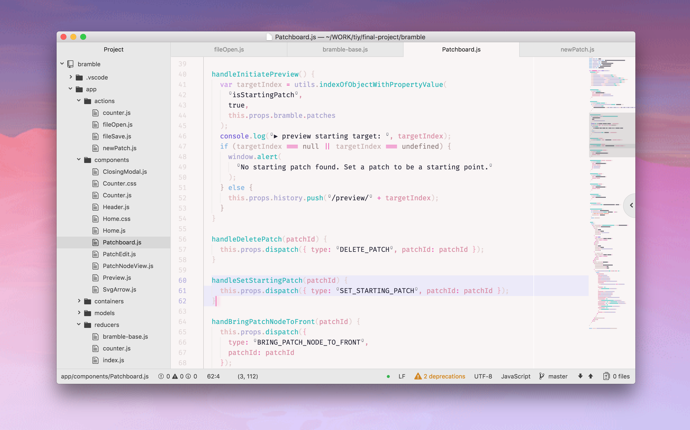

# \~ soft era \~

### syntax theme for [Atom](https://atom.io/)

🌸 Light pastel syntax theme for cozy, cute coding & typing. 🌱



> UI theme in screenshot is a WIP `soft era UI`. you can use One Light UI and [these CSS overrides](https://gist.github.com/animalphase/b18d087068bd64369d69d7e9acafb8b0) to use it now :)

\~.\~
<br>&nbsp;&nbsp;a soft, warm, low contrast theme,
<br>&nbsp;&nbsp;with pastel accents that are easy on your eyes

^.^
<br>&nbsp;&nbsp;make stuff and learn.
<br>&nbsp;&nbsp;make the world your kinda place.
<br>&nbsp;&nbsp;take care of the people around you

🌿

## Installation

- Go to **Settings > Install > Themes tab**
- Search for `soft-era-syntax` and click Install
- Go to **Settings > Themes** and choose **Soft Era** from the dropdown menu

###### or, from the command line:

```apm install soft-era-syntax```


💾 enjoy <3

---

### Fixes

Some UI may cause the cursor to appear as invisible, or the same as the background color, in search boxes. If you have this issue, you can add this to your stylesheet:

```
.cursor {
  color: rgba(244,129,187,1);
  border-left: 2px solid rgba(244,129,187,1) !important;
}
```

## Contributing

### TODO:
- [ ] do a full pass on markdown styles to make sure formatting is colored consistently with the rest of the system, and with the correct inheritence rules. reference the highlight colors in [soft era for VC Code](https://github.com/soft-aesthetic/soft-era-vs-code).
- [x] create variable for operator and whatever other `@soft-` is still in use in the `base.less` file
- [ ] this theme reports deprecations in the CSS selectors, pull in new version of atom one theme to compare/revise
  - [ ] also compare with the Flatwhite theme for colors & how they decides to higlight various elements.
  - [ ] if that doesn't work, just update selectors in this theme
- [ ] examine differences between the packages `react` (~500k downloads) and `language-babel` (~1.5m downloads), as they lead to different colors in a lot of cases.
- [ ] build in better support for  `language-babel`
  - [ ] theme selectors, particularly special javascript selectors, are built with the `react` way of handling things—this should not be treated as primary since it isn't default
  - [ ] see how styling works **without either of these packages activated**
- [ ] parameter vs arguments are fucked up
- [ ] determine other packages that require or would benefit from specific support.
  - [ ] group these into separate .less files. currently there are already special styles for the `indent-guide-improved` package, inside of `index.less`
- [ ] make html tag punctuation and text same color? (maybe depend on determining the differences of above-named packages)
- [ ] add support for package `language-markdown` -> [package contribution reference](https://github.com/burodepeper/language-markdown/blob/master/CONTRIBUTING.md#syntax-theme-support)
  - [ ] currently the quote characters put in `syntax--string` classes and that makes it not work well (especially when writing with punctuation)
- [ ] see about removing all direct color variables like `@cyan` from `base.less`
- [ ] move all color definitions into one place, written in a standardized way, to make it easier to keep track, make alternate versions of the theme, and port to other programs.
  - [ ] verify this is being done in the best way to match up with the latest theme code
- [ ] separate out "special treatments" and overrides. (most are currently at bottom of file, but there are some atom-specific treatments like before and after elements, special function coloring, italicizing words, changing font weight — appropriate to pull these out and group at bottom of file or in separate .less file?)
  - [ ] these seem to be a bit of a mess and first fixing some of the package support/conflicts above may help this organization
- [ ] nicer clickable link treatment (for markdown previews and wherever else they are clickable)

Much of this cleanup and organization is in the push to make this theme easier to 1) organize for porting to other editors, and 2) using the same organizational thought behind the syntax highlighting to quickly create other themes.

---

**Steps for cloning a repo** from http://flight-manual.atom.io/hacking-atom/sections/creating-a-theme/#creating-a-ui-theme

*if the editor loses track of the local working copy of this (or any) theme, follow steps `3` – `9`*

**must use `apm link` instead of `apm link --dev`** for this local theme to work in normal, non-dev editor instances.

(using `--dev` is a "safe mode" which will prevent the theme from activating in a normal window, in case you break something while editing.)

1. Fork the ui-theme-template [or this theme, if this is what you're forking]
1. Clone the forked repository to the local filesystem
1. Open a terminal in the forked theme's directory
1. Open your new theme in a Dev Mode Atom window run `atom --dev .` in the terminal or use the **View > Developer > Open in Dev Mode** menu
1. Change the name of the theme in the theme's package.json file
1. Name your theme end with a `-ui`, for example `super-white-ui` [for syntax themes like this package, use `-syntax` instead of `-ui`]
1. Run `apm link --dev` to symlink your repository to *~/.atom/dev/packages*
1. Reload Atom using `Alt+Cmd+Ctrl+L`
1. Enable the theme via the "UI Theme" drop-down in the "Themes" tab of the Settings View
1. Make changes! Since you opened the theme in a Dev Mode window, changes will be instantly reflected in the editor without having to reload.

---

Currently styled with `.js`, `.css`, `.html`, `.json`, `.md`, `.svg` files in mind as that's my main use case. Would like to hear more about other files/languages.

Happy to hear any input <3

💖 [@animalphase](https://twitter.com/animalphase) on twitter
