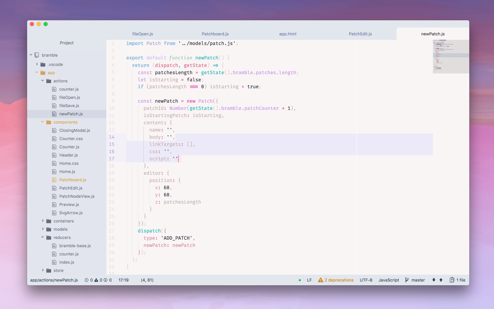

# \~ soft era \~

### syntax theme for [Atom](https://atom.io/)

🌸 Light pastel syntax theme for soft, warm, cozy, cute coding. 🌱

Begun by heavily modifying [new era light](https://github.com/juanmnl/new-era-light-syntax-theme).


## Installation

- Go to **Settings > Install > Themes tab**
- Search for `soft-era-syntax` and click Install
- Go to **Settings > Themes** and choose **Soft Era** from the dropdown menu

###### or, from the command line:

```apm install pure-syntax```


💾 enjoy <3

---

## User stylesheet modifications

### Fixes:

Some UI may cause the cursor to appear as invisible, or the same as the background color, in search boxes. If you have this issue, you can add this to your stylesheet:

```
.cursor {
  color: rgba(244,129,187,1);
  border-left: 2px solid rgba(244,129,187,1) !important;
}
```

### Suggested modifications for the default UI theme (One Light)

```
// style the active tab in One Light UI theme
@soft-purple-darker: #b4addf;
.tab-bar .tab.texteditor.active {
  background-color: #f9f5f5 !important;
}
.tab.texteditor.active::before {
  background: @soft-purple-darker !important;
  width: 4px !important;
}
.tab-bar .close-icon {
  color: @soft-purple-darkest !important;
}
.tab-bar .close-icon:hover {
  color: @soft-text-dark !important;
  background: #fff !important;
}
```

### Other modifications that compliment this theme nicely:

```
// BPMono is a cute rounded fond that looks nice in italics.

// Italic BPMono for comments:
atom-text-editor::shadow .comment {
  font-family: "BPMono";
  vertical-align: top;
  font-style: italic;
}

// Italic BPMono for function declaration:
// targets the word "function" when declaring a function
.syntax--type.syntax--function.syntax--js:not(.syntax--arrow) {
  font-family: "BPMono";
  font-style: italic;
}

// I like to use the Fira Code ligatures,
// even if i'm using another main font
.syntax--keyword.syntax--operator {
    font-family: "Fira Code";
}
```



---

## Contributing

### TODO:
- ~~create variable for operator and whatever other `@soft-` is still in use in the base.less file~~
- has deprecations, pull in new version of atom one theme to tweak?
- if that doesn't work, just update selectors in this theme
- see about removing all direct color variables like `@cyan` from base.less`
- move all color definitions into one place, written in a standardized way, to make it easier to keep track, make alternate versions of the theme, and port to other programs.
  - verify this is being done in the best way to match up with the latest theme code
- separate out "special treatments" and overrides. (most are currently at bottom of file, but there are some atom-specific treatments like before and after elements - should think if it's appropriate to pull these out?)

Currently styled with `.js`, `.css`, `.html`, `.json`, `.svg` files in mind.

Happy to hear any input <3

💖 [@animalphase](https://twitter.com/animalphase) on twitter
